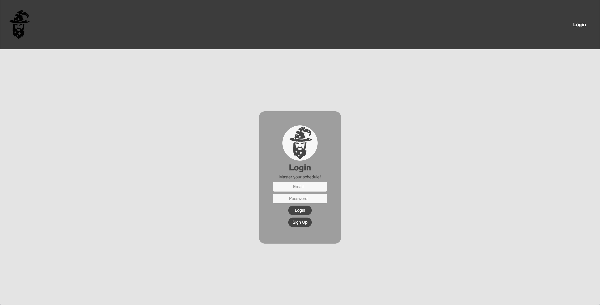
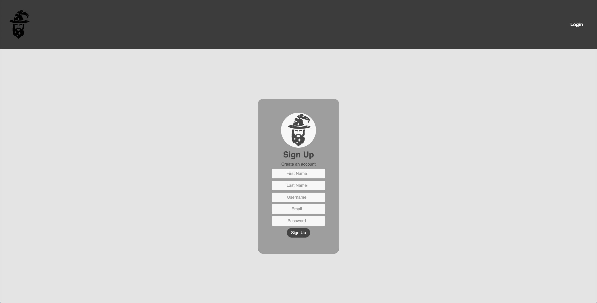
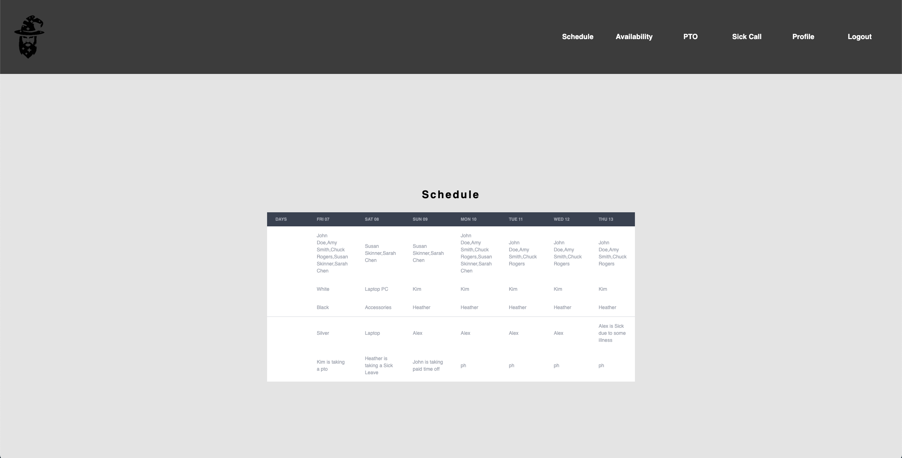

# Shift Wiz

  

## Description:
ShiftWiz is a revolutionary app designed to simplify work scheduling for small businesses. With its user-friendly interface, you can easily view your work schedule, submit requests for time off, and make modifications to your schedule with just a few clicks. No more need for cumbersome printouts or phone calls to find out when you're working next - everything you need is right at your fingertips!

The app also includes a feature for calling in sick, making it easy for employees to notify their managers of any unexpected absences. And that's not all - with future plans to implement a manager tab, managers will be able to easily accept or deny requests for time off and view calls in sick, making scheduling a breeze for everyone involved.

Say goodbye to the headaches of traditional scheduling and embrace the convenience of ShiftWiz. Try it out today and see for yourself how it can transform your work experience!

## Table of Contents:

* [Usage](#usage)
* [Screenshots](#screenshots)
* [License](#license)
* [Contributing](#contributing)
* [Tests](#tests)

## Usage:

Visit (placeholder) to sign up and test ShiftWiz for yourself!

## Screenshots:

## License

This project is licensed under the MIT license. Click [here](https://opensource.org/licenses/MIT) for more information. 

## Contributing:

NA

## Tests:

NA
